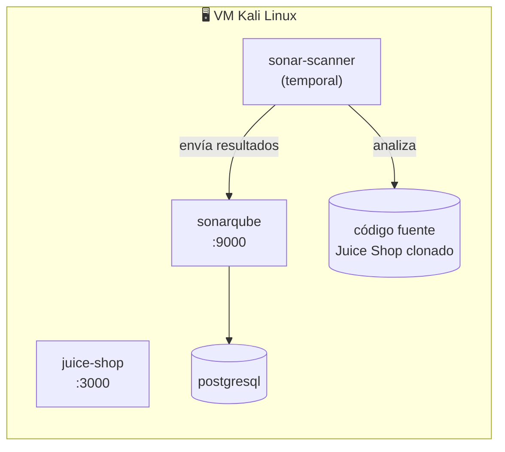

# 🛡️ Análisis SAST y DAST — SonarQube + OWASP Juice Shop

<p align="left">
  
  
  
  
  
</p>

Laboratorio práctico de **Análisis Estático de Seguridad (SAST)** sobre el código fuente de [OWASP Juice Shop](https://github.com/juice-shop/juice-shop), usando **SonarQube Community Build** dentro de una VM Kali Linux con Docker. Todo el despliegue se realiza manualmente, paso a paso, sin scripts de instalación, para reforzar la comprensión de cada componente.

> **📌 Nota:** este README documenta la actividad *Actividad 2.3 — Análisis SAST y DAST*. El foco principal es el análisis estático (SAST); el análisis dinámico (DAST) se referencia como contraste conceptual en la sección de resultados.

---

## 📑 Tabla de contenidos

1. [Objetivo](#-1-objetivo)
2. [Arquitectura del laboratorio](#-2-arquitectura-del-laboratorio)
3. [Requisitos de la máquina virtual](#-3-requisitos-de-la-máquina-virtual)
4. [Actualizar Kali Linux](#-4-actualizar-kali-linux)
5. [Instalar y habilitar Docker](#-5-instalar-y-habilitar-docker)
6. [Configurar los requisitos del sistema para SonarQube](#-6-configurar-los-requisitos-del-sistema-para-sonarqube)
7. [Crear la carpeta de trabajo](#-7-crear-la-carpeta-de-trabajo)
8. [Crear manualmente Docker Compose](#-8-crear-manualmente-docker-compose)
9. [Descargar las imágenes](#-9-descargar-las-imágenes)
10. [Iniciar los servicios](#-10-iniciar-los-servicios)
11. [Acceder desde el navegador](#-11-acceder-desde-el-navegador)
12. [Configurar SonarQube manualmente](#-12-configurar-sonarqube-manualmente)
13. [Descargar el código fuente de Juice Shop](#-13-descargar-el-código-fuente-de-juice-shop)
14. [Crear la configuración del proyecto](#-14-crear-la-configuración-del-proyecto)
15. [Introducir el token sin guardarlo en el historial](#-15-introducir-el-token-sin-guardarlo-en-el-historial)
16. [Ejecutar manualmente SonarScanner](#-16-ejecutar-manualmente-sonarscanner)
17. [Revisar los resultados](#-17-revisar-los-resultados)
18. [Evidencias solicitadas](#-18-evidencias-solicitadas)

---

## 🎯 1. Objetivo

Instalar Docker en una máquina virtual Kali Linux, desplegar **OWASP Juice Shop** y **SonarQube Community Build**, y realizar manualmente un análisis estático del código fuente de Juice Shop.

> ⚠️ Esta actividad **no utiliza scripts de instalación**. Cada paso debe ejecutarse y verificarse por separado.

## 🧱 2. Arquitectura del laboratorio

La VM ejecuta cuatro contenedores:

| Contenedor | Rol | Puerto |
|---|---|---|
| `juice-shop` | Aplicación vulnerable objetivo del análisis | `3000` |
| `sonarqube` | Servidor de análisis estático (SAST) | `9000` |
| `postgresql` | Base de datos utilizada por SonarQube | interno |
| `sonar-scanner` | Contenedor temporal que ejecuta el análisis del código | — |



> **📌 Importante:** el análisis estático se realiza sobre el **código fuente descargado** (clonado con `git`). SonarQube **no** analiza el contenedor de Juice Shop que está en ejecución — son dos cosas distintas.

## 💻 3. Requisitos de la máquina virtual

| Recurso | Valor recomendado |
|---|---|
| Sistema operativo | Kali Linux 64 bits, actualizado |
| CPU | 4 procesadores virtuales |
| RAM | 8 GB |
| Disco | 30 GB libres |
| Red | Adaptador NAT (laboratorio local) |
| Conectividad | Acceso a Internet |

> ⚠️ **Advertencia de seguridad:** antes de comenzar, crear una **instantánea (snapshot)** de la VM. OWASP Juice Shop contiene vulnerabilidades intencionales y **no debe publicarse en Internet**.

## 🔄 4. Actualizar Kali Linux

Abrir una terminal en Kali y ejecutar:

```bash
sudo apt update
sudo apt install -y git curl nano docker.io docker-compose
```

Reiniciar la VM si el sistema actualizó el kernel:

```bash
sudo reboot
```

## 🐳 5. Instalar y habilitar Docker

Iniciar Docker y configurarlo para que arranque con Kali:

```bash
sudo systemctl enable docker --now
sudo systemctl status docker --no-pager
```

Agregar el usuario actual al grupo `docker`:

```bash
sudo usermod -aG docker "$USER"
```

> 🔁 Cerrar la sesión de Kali y volver a iniciarla. El cambio de grupo **no se aplica** hasta iniciar una sesión nueva.

Verificar la instalación:

```bash
docker --version
docker compose version
docker run --rm hello-world
```

Si `docker compose version` no funciona, comprobar el comando clásico:

```bash
docker-compose --version
```

En ese caso, reemplazar `docker compose` por `docker-compose` en el resto de la actividad.

## ⚙️ 6. Configurar los requisitos del sistema para SonarQube

SonarQube utiliza un motor de búsqueda (Elasticsearch) que necesita límites superiores a los valores predeterminados de algunas instalaciones Linux.

Aplicarlos temporalmente:

```bash
sudo sysctl -w vm.max_map_count=524288
sudo sysctl -w fs.file-max=131072
```

Verificar:

```bash
sysctl vm.max_map_count
sysctl fs.file-max
```

Para conservarlos después de reiniciar, crear el archivo:

```bash
sudo nano /etc/sysctl.d/99-sonarqube.conf
```

Escribir:

```text
vm.max_map_count=524288
fs.file-max=131072
```

Guardar con `Ctrl+O`, confirmar con `Enter` y salir con `Ctrl+X`. Aplicar la configuración:

```bash
sudo sysctl --system
```

## 📁 7. Crear la carpeta de trabajo

```bash
mkdir -p ~/laboratorio-sonarqube
cd ~/laboratorio-sonarqube
```

Comprobar la ubicación:

```bash
pwd
```

El resultado debe terminar en `/laboratorio-sonarqube`.

## 📝 8. Crear manualmente Docker Compose

Crear el archivo:

```bash
nano docker-compose.yml
```

Escribir el siguiente contenido:

```yaml
services:
  sonarqube:
    image: sonarqube:community
    container_name: sonarqube
    read_only: true
    depends_on:
      postgresql:
        condition: service_healthy
    environment:
      SONAR_JDBC_URL: jdbc:postgresql://postgresql:5432/sonar
      SONAR_JDBC_USERNAME: sonar
      SONAR_JDBC_PASSWORD: sonar
    ports:
      - "9000:9000"
    volumes:
      - sonarqube_data:/opt/sonarqube/data
      - sonarqube_extensions:/opt/sonarqube/extensions
      - sonarqube_logs:/opt/sonarqube/logs
      - sonarqube_temp:/opt/sonarqube/temp
    tmpfs:
      - /tmp:size=256M,mode=1777

  postgresql:
    image: postgres:17
    container_name: postgresql
    healthcheck:
      test: ["CMD-SHELL", "pg_isready -d sonar -U sonar"]
      interval: 10s
      timeout: 5s
      retries: 5
    environment:
      POSTGRES_USER: sonar
      POSTGRES_PASSWORD: sonar
      POSTGRES_DB: sonar
    volumes:
      - postgresql_data:/var/lib/postgresql/data

  juice-shop:
    image: bkimminich/juice-shop
    container_name: juice-shop
    ports:
      - "3000:3000"

volumes:
  sonarqube_data:
  sonarqube_extensions:
  sonarqube_logs:
  sonarqube_temp:
  postgresql_data:
```

Guardar y salir. Validar el archivo antes de iniciar:

```bash
docker compose config
```

El comando debe mostrar la configuración procesada sin errores.

## ⬇️ 9. Descargar las imágenes

```bash
docker compose pull
```

Comprobar las imágenes descargadas:

```bash
docker images
```

Deben aparecer **SonarQube Community Build**, **PostgreSQL** y **Juice Shop**.

## ▶️ 10. Iniciar los servicios

```bash
docker compose up -d
```

Comprobar el estado:

```bash
docker compose ps
```

- Juice Shop debe aparecer en ejecución.
- PostgreSQL debe cambiar a `healthy`.
- SonarQube puede necesitar entre uno y tres minutos para iniciar.

Observar el inicio de SonarQube:

```bash
docker logs -f sonarqube
```

Cuando aparezca el mensaje que indica que SonarQube está operativo, salir de los registros con `Ctrl+C`. Esto no detiene el contenedor.

Verificar mediante HTTP:

```bash
curl http://localhost:9000/api/system/status
curl -I http://localhost:3000
```

SonarQube debe informar `"status":"UP"` y Juice Shop debe responder con un código HTTP correcto.

## 🌐 11. Acceder desde el navegador

Si el navegador está dentro de Kali, abrir:

- `http://localhost:3000` → Juice Shop
- `http://localhost:9000` → SonarQube

Si se utiliza el navegador del equipo anfitrión, obtener la dirección de la VM:

```bash
hostname -I
```

Con una red puente, abrir `http://IP_DE_LA_VM:3000` y `http://IP_DE_LA_VM:9000`.

> ⚠️ Con una red NAT de VirtualBox o VMware puede ser necesario configurar reenvío TCP de los puertos 3000 y 9000. **Para reducir la exposición, se recomienda realizar toda la actividad desde el navegador de Kali.**

## 🔑 12. Configurar SonarQube manualmente

Abrir `http://localhost:9000` e iniciar sesión con las credenciales iniciales:

```text
Usuario:     admin
Contraseña:  admin
```

SonarQube solicitará cambiar la contraseña. Utilizar una contraseña exclusiva para el laboratorio.

Crear el proyecto:

1. Seleccionar `Create a local project` o `Manually`.
2. Escribir `OWASP Juice Shop` como nombre.
3. Escribir `juice-shop` como clave del proyecto.
4. Seleccionar la configuración global del nuevo código.
5. Crear el proyecto.
6. Elegir el método de análisis local.
7. Generar un token de análisis.
8. Mantener la página abierta hasta usar el token.

> 🔒 **No** incluir el token en capturas, informes ni archivos del proyecto.

## 📥 13. Descargar el código fuente de Juice Shop

Volver a la terminal:

```bash
cd ~/laboratorio-sonarqube
git clone --depth 1 https://github.com/juice-shop/juice-shop.git
cd juice-shop
```

Comprobar el contenido:

```bash
ls
git status
```

> La imagen Docker permite *ejecutar* Juice Shop, pero **este repositorio clonado** es el que se utilizará para el análisis estático.

## 🧩 14. Crear la configuración del proyecto

Dentro de `~/laboratorio-sonarqube/juice-shop`, crear:

```bash
nano sonar-project.properties
```

Escribir:

```properties
sonar.projectKey=juice-shop
sonar.projectName=OWASP Juice Shop
sonar.sources=.
sonar.sourceEncoding=UTF-8
sonar.exclusions=**/node_modules/**,**/dist/**,**/build/**,**/coverage/**,**/.git/**,**/data/**,**/ftp/**,**/test/**,**/tests/**
```

Guardar y verificar:

```bash
cat sonar-project.properties
```

## 🔐 15. Introducir el token sin guardarlo en el historial

Ejecutar:

```bash
read -s -p "Token de SonarQube: " SONAR_TOKEN
echo
export SONAR_TOKEN
```

Pegar el token generado en la interfaz y pulsar `Enter`. El texto no se mostrará en la terminal.

Comprobar solamente que la variable tiene contenido:

```bash
test -n "$SONAR_TOKEN" && echo "Token cargado"
```

## 🔍 16. Ejecutar manualmente SonarScanner

Confirmar que la terminal sigue en el repositorio:

```bash
pwd
```

Ejecutar el análisis:

```bash
docker run --rm \
  --network host \
  -e SONAR_HOST_URL="http://localhost:9000" \
  -e SONAR_TOKEN="$SONAR_TOKEN" \
  -v "$PWD:/usr/src" \
  sonarsource/sonar-scanner-cli
```

La imagen del escáner se descargará durante la primera ejecución. El resultado correcto debe terminar con:

```text
ANALYSIS SUCCESSFUL
EXECUTION SUCCESS
```

## 📊 17. Revisar los resultados

Abrir:

```text
http://localhost:9000/dashboard?id=juice-shop
```

Revisar estas secciones:

| Sección | Contenido |
|---|---|
| **Overview** | Resumen y estado de la puerta de calidad (*Quality Gate*) |
| **Issues** | Bugs, vulnerabilidades y problemas de mantenibilidad |
| **Security Hotspots** | Código sensible que requiere revisión humana |
| **Measures** | Líneas de código, complejidad, duplicación y cobertura |
| **Code** | Navegación por los archivos analizados |

> **🧠 SAST vs. DAST:** SonarQube realiza **SAST** (análisis estático, sobre el código fuente). Que una vulnerabilidad intencional de Juice Shop no aparezca como `Vulnerability` **no significa que no exista**: algunas requieren flujo de datos, contexto de ejecución, revisión manual o **análisis dinámico (DAST)** — es decir, atacar la aplicación en ejecución en lugar de leer su código.

## ✅ 18. Evidencias solicitadas

- [ ] Recursos asignados a la VM.
- [ ] Versiones de Docker y Docker Compose.
- [ ] `docker compose ps` con los tres servicios activos.
- [ ] Juice Shop abierto en el navegador.
- [ ] SonarQube con el proyecto `OWASP Juice Shop`.
- [ ] Terminal mostrando `EXECUTION SUCCESS`.
- [ ] Resumen de resultados de SonarQube.
- [ ] Un *bug* o *code smell* con su archivo y línea.
- [ ] Un *security hotspot* y su explicación.

---

<p align="center"><sub>Actividad práctica de laboratorio — Análisis SAST/DAST con SonarQube Community Build y OWASP Juice Shop.</sub></p>
